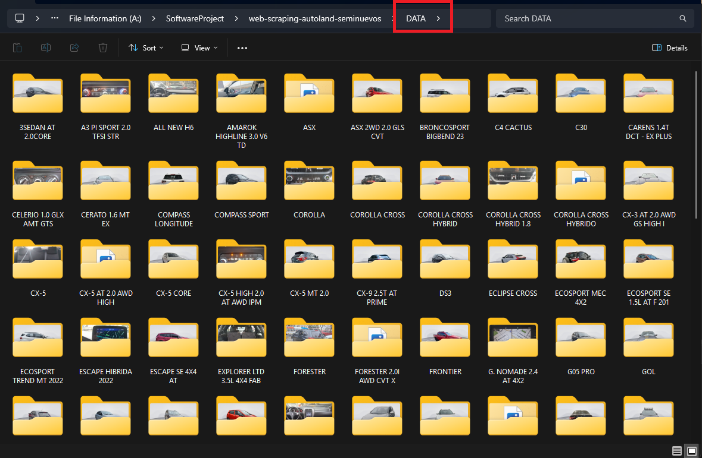

# web-scraping-autoland-seminuevos
Script en nodejs, para descargar imagenes, informacion detallada de los autos seminuevos en autoland

# Información
1. Ejecutar el comando  `npm run local`. (Este comando lo que hace correr el script), todo es automatico, no debes cambiar nada.
2. Ver el resultado, aparecerá en la raíz una carpeta llamada `DATA`, dentro encontrarás esto.
   
 
--- 
